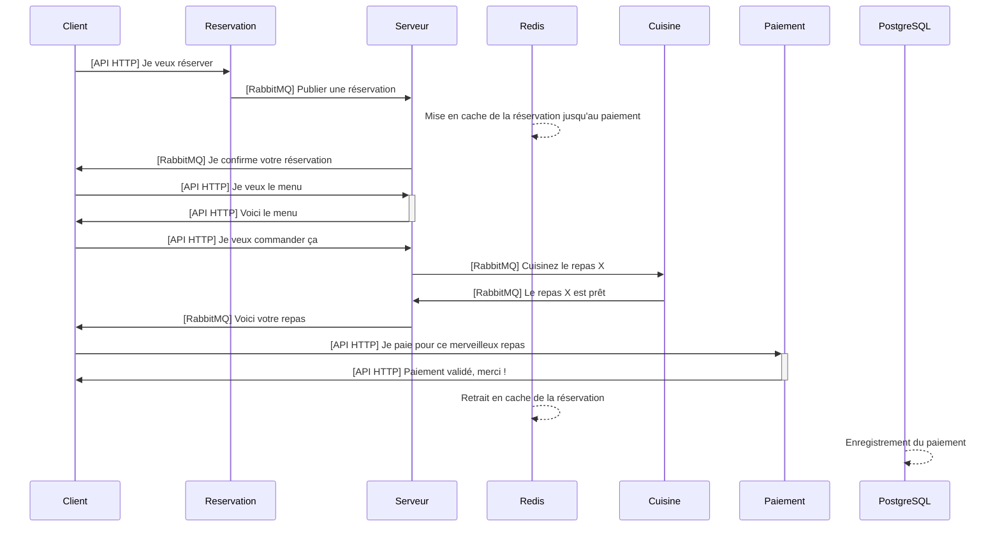

# TP : Mise en place d'un système d'observabilité

L'objectif de ce projet est de mettre en place une solution complète d'observabilité (Métriques, Journaux/Logs et Traces) sur une application simulant pendant 1 heure le fonctionnement d'un restaurant.

## 1. Contexte du projet et Fonctionnement de l'application

L'application qui vous est fournie est une architecture orientée microservices écrite en Python. Elle simule la gestion des commandes d'un restaurant, de la réservation d'un client jusqu'au paiement, en passant par la préparation en cuisine.

### 1.1. Les composants de l'infrastructure
L'infrastructure repose sur des conteneurs Docker (orchestrés via le fichier `docker-compose.yml`) et utilise les briques suivantes :
- **PostgreSQL** : Base de données relationnelle (stockage des menus et des reçus de paiement).
- **Redis** : Base de données en mémoire (sert de cache pour suivre l'état d'une réservation en temps réel).
- **RabbitMQ** : Broker de messages permettant la communication asynchrone entre les services (système de files d'attente / queues).

### 1.2. Les microservices applicatifs
L'application est découpée en 5 services distincts :
- **Customer (Client)** : Un générateur de charge. Ce service simule des clients qui font des réservations à intervalles réguliers, commandent des plats et paient à la fin.
- **Reservation** : Expose une API HTTP pour prendre les réservations, les enregistre dans Redis et publie un message dans RabbitMQ.
- **Waiter (Serveur)** : Agit comme l'intermédiaire. Il écoute les réservations, donne les menus, prend les commandes et communique avec la cuisine.
- **Kitchen (Cuisine)** : Service asynchrone qui écoute les commandes sur RabbitMQ, simule un temps de préparation, puis prévient que le plat est prêt.
- **Payment (Paiement)** : Gère le paiement final via une API HTTP, l'enregistre de manière persistante dans PostgreSQL, puis met à jour l'état dans Redis.

### 1.3. Flux de l'application (Le parcours d'une commande)

Voici un diagramme de séquence simplifié des échanges entre les différents services :



## 2. Objectifs du TP

Votre mission est d'instrumenter cette application pour la rendre totalement **observable**. En tant qu'ingénieurs Infra et Cloud, on attend de vous que vous déployiez et configuriez les bons outils pour récolter, stocker et visualiser les données de télémétrie.

Vous êtes **libres de choisir vos outils** (Stack Elastic/ELK, Prometheus + Grafana, Loki, Jaeger, OpenTelemetry, etc.).

### 2.1. Définition des indicateurs de fiabilité (SLI, SLO, SLA)
Avant de mettre en place vos outils, vous devez définir le contrat de service de votre application :
- **SLI (Service Level Indicator)** : Identifiez des indicateurs pertinents, mesurables et ayant un impact réel pour l'utilisateur final.
- **SLO (Service Level Objective)** : Définissez des objectifs atteignables basés sur vos SLI.
- **SLA (Service Level Agreement)** : Définissez des garanties en lien avec vos SLO et incluez une clause de pénalité (ou non-respect) en guise de garantie au client.
Vos tableaux de bord et vos métriques devront vous permettre de vérifier si ces objectifs sont respectés.

### 2.2. Les Journaux (Logs)
Actuellement, les différents services Python génèrent des logs, mais ceux-ci sont écrits localement dans des fichiers textes (`customer.log`, `waiter.log`, etc.) à l'intérieur des conteneurs.
- **Attendu** : Mettre en place un système de collecte et de stockage centralisé de ces logs (ex: Filebeat, Logstash, etc.). Vous devez être capables de chercher une erreur ou de suivre les logs d'une réservation spécifique (grâce au `reservation_id`) depuis une interface de recherche. Les journaux doivent permettre d'identifier rapidement la source d'une panne.

### 2.3. Les Traces
L'application communique beaucoup (requêtes HTTP et messages RabbitMQ). Il est crucial de pouvoir suivre une requête de bout en bout pour identifier les goulots d'étranglement ou les pannes réseau.
- *Indice* : Du code **OpenTelemetry** a commencé à être implémenté par les développeurs dans les fichiers Python (vous pouvez notamment le voir dans les variables d'environnement `OTEL_*` dans le `docker-compose.yml`).
- **Attendu** : Mettre en place un système de tracing des connexions middleware (entre les différents services). Assurez-vous que les traces remontent bien dans un outil de visualisation.

### 2.4. Les Métriques
L'application et l'infrastructure sous-jacente doivent être monitorées pour comprendre leurs performances et leur état de santé en continu.
- **Attendu** : Mettre en place un système de surveillance des métriques hardware (surveillance matérielle) pour l'ensemble des 8 services déployés (à minima les applications Python). Collectez également des métriques applicatives pertinentes qui permettent de vérifier le respect des SLO.
- *Indice* : Les développeurs ont installé une librairie Python qui expose automatiquement un endpoint `/metrics` sur chaque API (Waiter sur le port 5001, Payment sur le port 5003, Reservation sur le port 5004). Apparemment, cette librairie serait compatible avec Prometheus.

### 2.5. Gestion d'incident (Panne)
Une fois votre système d'observabilité en place, vous devrez identifier une panne sur votre infrastructure. Il faudra analyser les logs, métriques et traces pour comprendre l'origine de la panne, puis apporter une solution.
- **Identification** : Quelle est la conséquence de la panne (visible sur vos métriques) ? Quelle est la source de la panne ?
- **Résolution** : Apportez une réponse claire et efficace permettant un retour au fonctionnement normal de l'application.
- **Communication** : Rédigez un message de communication de panne (À qui communique-t-on ? Quel est le message ? Pourquoi communique-t-on ?).

## 3. Livrables attendus

1. **Code d'infrastructure et configuration** : Le fichier `docker-compose.yml` mis à jour (les 8 services doivent être déployés et monitorés) et les fichiers de configuration de vos agents/collecteurs.
2. **Rapport de projet** : Un document de synthèse comprenant :
   - Vos choix technologiques et les instructions de lancement.
   - La définition détaillée de vos **SLI, SLO et SLA**.
   - Le compte-rendu de la **gestion d'incident** (Conséquence, Source, Piste de résolution, Communication).
   - *Annexe* : Un plan de votre architecture logicielle.
   - *Critères de forme* : Le document devra faire l'objet d'une mise en page professionnelle (texte justifié, parties clairement séparées, orthographe soignée - préparation au RNCP).
3. **Tableaux de bord** : Des captures d'écran prouvant la présence de :
   - Un tableau de bord de surveillance pour les métriques.
   - Un tableau de bord pour les traces.
   - Un tableau de bord pour les logs.

## 4. Installation

Pré-requis :
- Docker installé
- ~4 Go RAM

Lancement :
```bash
docker compose -f docker-compose.yml up -d --build
```

Images Docker recommandées :
- Python : python:3.13-slim
- PostgreSQL : postgres:16
- RabbitMQ : rabbitmq:management
- Redis : redis:7